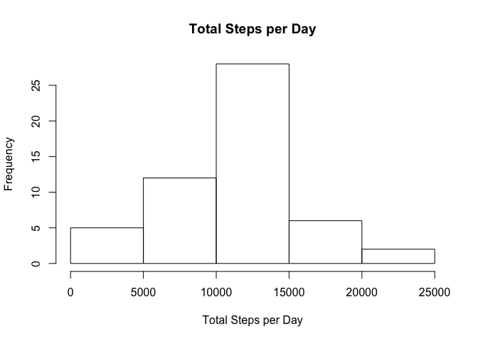
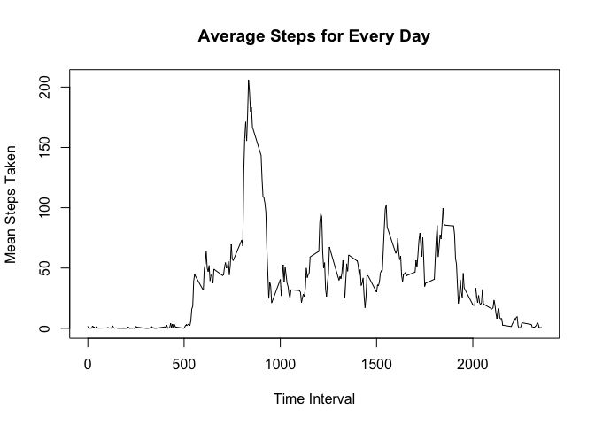
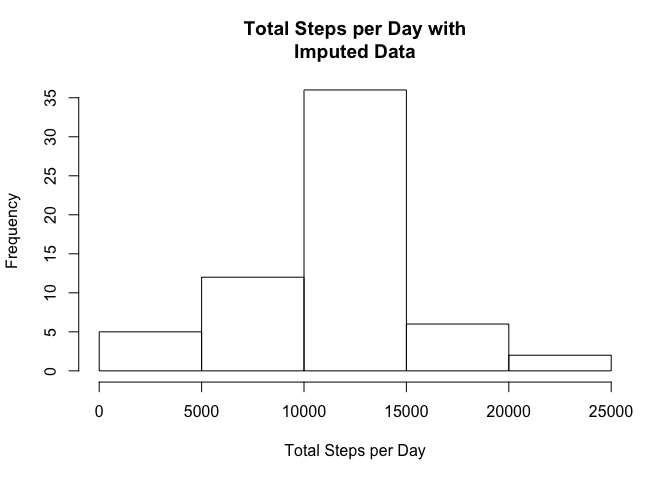
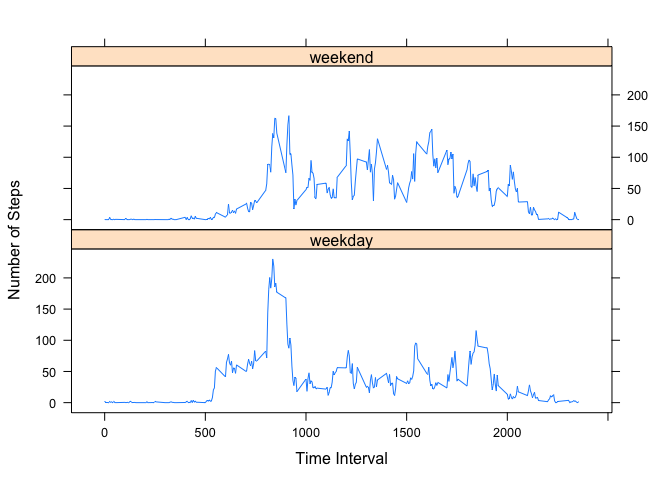

Week 2 Project
--------------

### Loading and preprocessing the data

``` r
# first we need to load the data (assuming in working directory)
fitness_data <- read.csv('activity.csv')
# for this part we can use complete cases (no NA) only
complete_fitness <- complete.cases(fitness_data)
fitness_data_no_na <- fitness_data[complete_fitness, ]
summary(fitness_data_no_na)
```

    ##      steps                date          interval     
    ##  Min.   :  0.00   2012-10-02:  288   Min.   :   0.0  
    ##  1st Qu.:  0.00   2012-10-03:  288   1st Qu.: 588.8  
    ##  Median :  0.00   2012-10-04:  288   Median :1177.5  
    ##  Mean   : 37.38   2012-10-05:  288   Mean   :1177.5  
    ##  3rd Qu.: 12.00   2012-10-06:  288   3rd Qu.:1766.2  
    ##  Max.   :806.00   2012-10-07:  288   Max.   :2355.0  
    ##                   (Other)   :13536

### What is the mean number of steps taken per day?

Calculate the total number of steps per day

``` r
steps_per_day <- aggregate(steps ~ date, data = fitness_data_no_na, sum)
```

Make a histogram of total steps per day

``` r
hist(steps_per_day$steps, main = 'Total Steps per Day', xlab = 'Total Steps per Day')
```



Calculate mean and median steps per day

``` r
mean_steps_per_day <- aggregate(steps ~ date, data = fitness_data_no_na, mean)
summary(steps_per_day)
```

    ##          date        steps      
    ##  2012-10-02: 1   Min.   :   41  
    ##  2012-10-03: 1   1st Qu.: 8841  
    ##  2012-10-04: 1   Median :10765  
    ##  2012-10-05: 1   Mean   :10766  
    ##  2012-10-06: 1   3rd Qu.:13294  
    ##  2012-10-07: 1   Max.   :21194  
    ##  (Other)   :47

The mean is 10766 steps per day and the median is 10765 steps per day.

### What is the average daily activity pattern?

Make a time series plot of the 5-minute interval and average steps taken

``` r
steps_interval <- aggregate(steps ~ interval, data = fitness_data_no_na, mean)
plot(steps_interval$interval, steps_interval$steps, type = 'l', main = 'Average Steps for Every Day', xlab = 'Time Interval', ylab = 'Mean Steps Taken')
```



Which 5-minute interval is highest on average?

``` r
max_steps <- which.max(steps_interval$steps)
steps_interval[max_steps, ]
```

    ##     interval    steps
    ## 104      835 206.1698

It looks like time interval 835 has the highest mean steps taken (206.17).

### Imputing missing data

Calculate and report total number of rows with NA

``` r
sum(is.na(fitness_data))
```

    ## [1] 2304

Devise a strategy for missing data and create new 'full' data set

``` r
# I will use the mean for the 5-minute intervals that we just did. That seems a little more specific than mean/median per day
fitness_data_imputed <- fitness_data # make copy to fill
# loop to fill NA steps with mean 5-minute interval steps
for (i in 1:nrow(fitness_data_imputed)) {
  if (is.na(fitness_data_imputed$steps[i]) == TRUE) {
    int_val <- fitness_data_imputed$interval[i]
    steps_val <- steps_interval[steps_interval$interval == int_val, ]
    fitness_data_imputed$steps[i] <- steps_val$steps
  }
}
## check to make sure there are no more NAs
sum(is.na(fitness_data_imputed))
```

    ## [1] 0

The new data set, *fitness\_data\_imputed* has no NA values.

Make a histogram of imputed steps data

``` r
imputed_steps_day <- aggregate(steps ~ date, data = fitness_data_imputed, sum)
hist(imputed_steps_day$steps, main = 'Total Steps per Day with\nImputed Data', xlab = 'Total Steps per Day')
```



Calculate the mean and median

``` r
summary(imputed_steps_day)
```

    ##          date        steps      
    ##  2012-10-01: 1   Min.   :   41  
    ##  2012-10-02: 1   1st Qu.: 9819  
    ##  2012-10-03: 1   Median :10766  
    ##  2012-10-04: 1   Mean   :10766  
    ##  2012-10-05: 1   3rd Qu.:12811  
    ##  2012-10-06: 1   Max.   :21194  
    ##  (Other)   :55

The mean is 10766 steps per day and the median is also 10766 steps per day. It is not surprising that imutping the data had no effect on these statistics. Because we chose to impute with a mean, we are just moving the data even closer to that measured mean. If we chose another method, say we had no idea and replaced all NA with 0, we would definitely see movement in these statistics.

### Differences in weekdays vs weekends

Create a new factor designating weekday/weekend

``` r
fitness_data_imputed$day <- weekdays(as.Date(fitness_data_imputed$date))
fitness_data_imputed$day_end <- ifelse(fitness_data_imputed$day %in% c('Saturday', 'Sunday'), 'weekend', 'weekday')
fitness_data_imputed$day_end <- as.factor(fitness_data_imputed$day_end)
```

Make a panel plot for average steps by interval separated by weekday/weekend

``` r
# first the data that we need
average_imputed_steps <- aggregate(steps ~ interval + day_end, data = fitness_data_imputed, mean)
# now plot it using lattice
library(lattice)
xyplot(steps ~ interval|factor(day_end), data = average_imputed_steps, type = 'l', layout = c(1,2), col = 'dodgerblue', ylab = 'Number of Steps', xlab = 'Time Interval')
```


